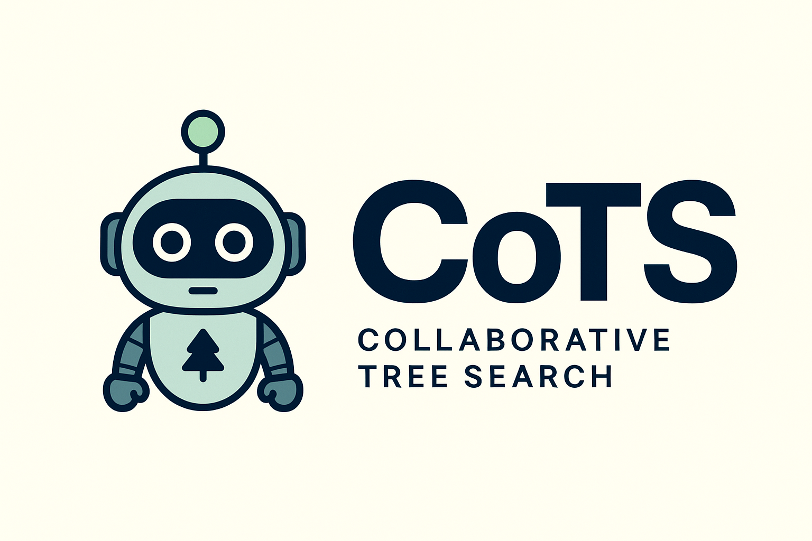
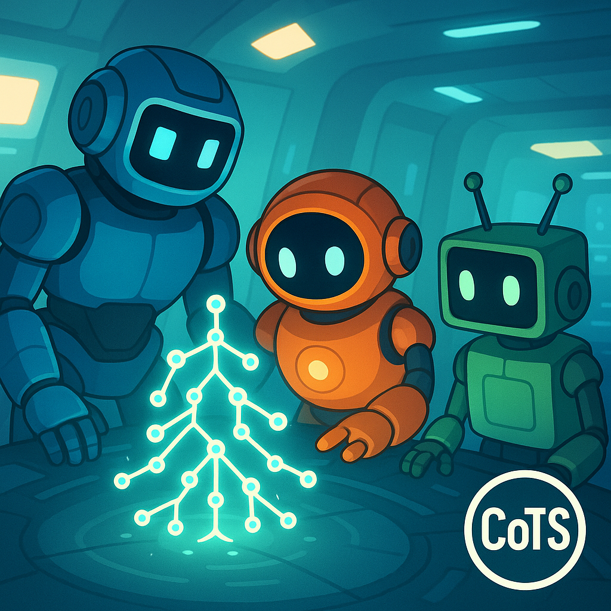
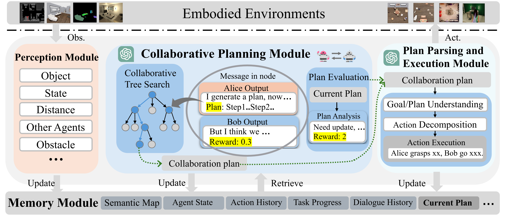
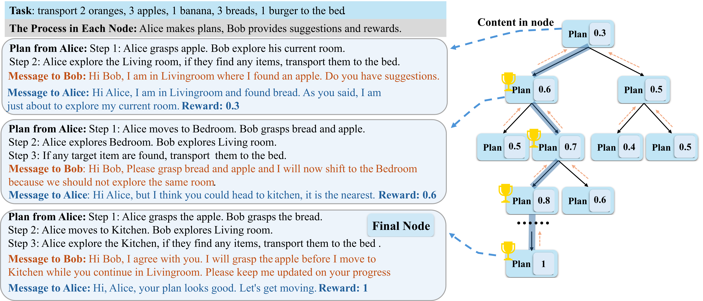

<div align="center">
  
  <h1>🤖 CoTS: Collaborative Tree Search for Embodied Multi-Agent Systems</h1>
  <h3>🏆 CVPR 2025 • Multi-Agent Collaboration Meets Language Models</h3>
</div>


<p align="center">
<a href="https://arxiv.org/abs/XXXX.XXXXX" alt="arXiv">
    </a>
<a href="https://pytorch.org/"></a>
<a href="https://opensource.org/licenses/MIT"></a>
</p>

<p align="center">


</p>

---

This repository contains the official implementation of our CVPR 2025 paper:

**Collaborative Tree Search for Enhancing Embodied Multi-Agent Collaboration**  
_Lizheng Zu, Lin Lin, Song Fu, Na Zhao, Pan Zhou_  

> CoTS (Cooperative Tree Search) is a collaborative framework for embodied agents based on large language models, which enhances multi-agent planning and execution by guiding strategic discussions within a modified Monte Carlo Tree Search and evaluating plans to ensure coherent, efficient teamwork in complex tasks.

---
## 🧠 Framework of CoTS 

> **🧭 Plan → 🪞 Reflect & Score → 🌲 Search → ✅ Act**

CoTS builds upon the architecture of [CoELA](https://umass-embodied-agi.github.io/CoELA/), enables multiple LLM-based embodied agents to collaborate effectively by integrating large language models into a dynamic tree-based decision-making process. The four key stages are:

- 🧭 **Plan**: Agents collaboratively propose high-level strategies using LLM-generated dialogues.
- 🪞 **Reflect & Score**: Plans are reflected upon using custom LLM-based reward signals.
- 🌲 **Search**: A Monte Carlo Tree is built with branching proposals, allowing agents to evaluate multiple paths and correct one another.
- ✅ **Act**: Once a coherent plan is validated, agents execute actions in coordination. A plan evaluation module ensures consistency and adapts if plans become unsuitable.

<p align="center">
  
</p>

---

## 🌲 Cooperative Tree Search

CoTS enables agents to collaborate within a shared Monte Carlo Tree by generating, evaluating, and optimizing plans through language. The figure below illustrates the structure and process of this **collaborative tree search**.

<p align="center">
  
</p>

> **🧩 How it works:**  
> Each node in the tree contains content generated by **Alice** and **Bob**:  
> - 🤖 *Alice* proposes collaborative plans and sends messages to Bob.  
> - 🤖 *Bob* responds with messages to Alice and computes plan rewards.  
> These rewards are used to backpropagate values, guiding the search process toward more promising and coherent joint plans.


---

## 📄 Paper
- Paper (CVPR 2025): [Coming soon]
- Project Website: [Coming soon]

---

## Installation

For detailed instructions on the installation of the two embodied multi-agent environments `Communicative Watch-And-Help` and `ThreeDWorld Multi-Agent Transport`, please refer to the Setup sections in `cwah/README.md` and `tdw_mat/README.md` respectively.

---

## 🚀 Running CoTS

We provide ready-to-use scripts for running CoTS in the following multi-agent embodied environments:

- 🏗️ **TDW-MAT** (`ThreeDWorld Multi-Agent Transport`) — [`tdw_mat/scripts`](tdw_mat/scripts)  
- 🤝 **CWAH** (`Communicative Watch-And-Help`) — [`cwah/scripts`](cwah/scripts)

▶️ Example: Run CoTS in TDW-MAT using GPT-4

```bash
./scripts/test_LMs-gpt-4.sh
```

---

## 📚 Citation
If you find CoTS helpful in your research, please consider citing:

```bibtex
@inproceedings{zu2025cots,
  title={Collaborative Tree Search for Enhancing Embodied Multi-Agent Collaboration},
  author={Zu, Lizheng and Lin, Lin and Fu, Song and Zhao, Na and Zhou, Pan},
  booktitle={Proceedings of the IEEE/CVF Conference on Computer Vision and Pattern Recognition (CVPR)},
  year={2025}
}
```

---

## 🤝 Acknowledgements
This work builds on the foundation of [CoELA](https://github.com/umass-embodied-agi/CoELA). We thank the original authors for releasing their code and environment.

---
