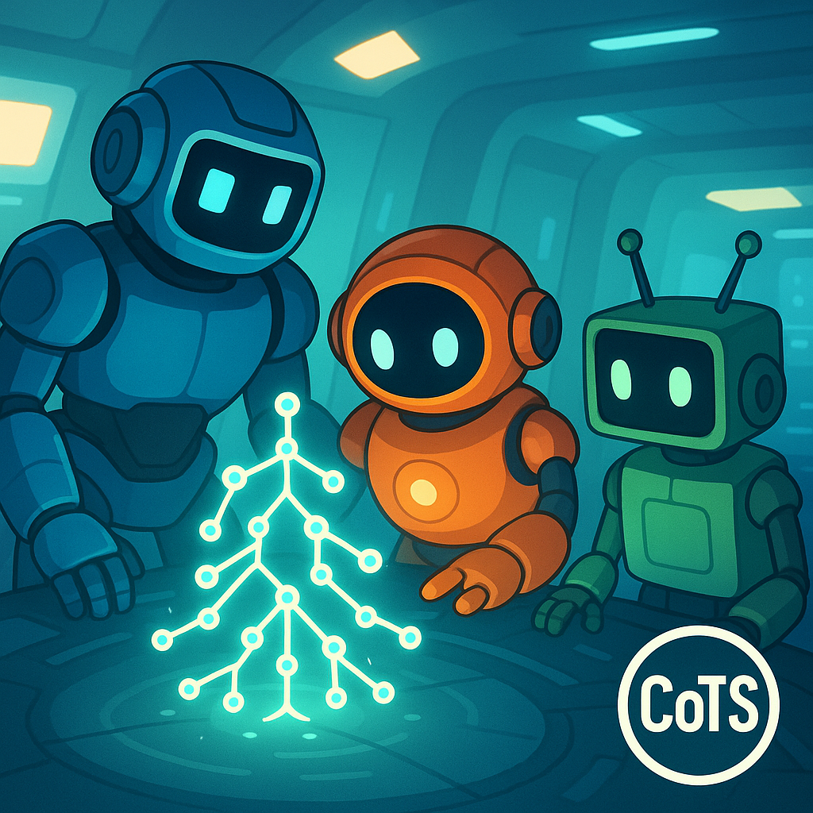
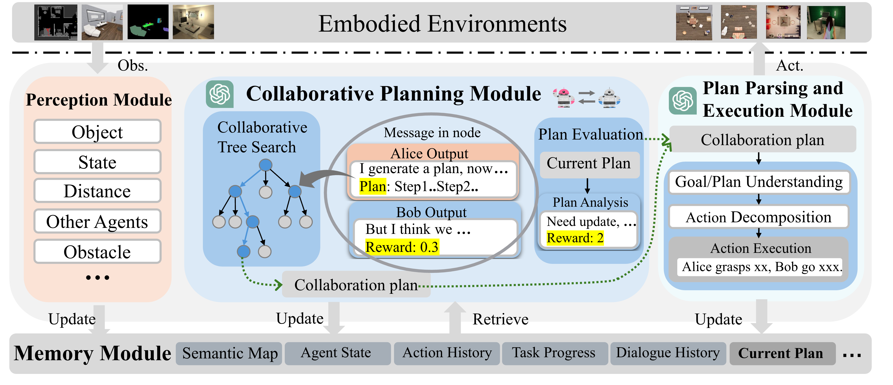
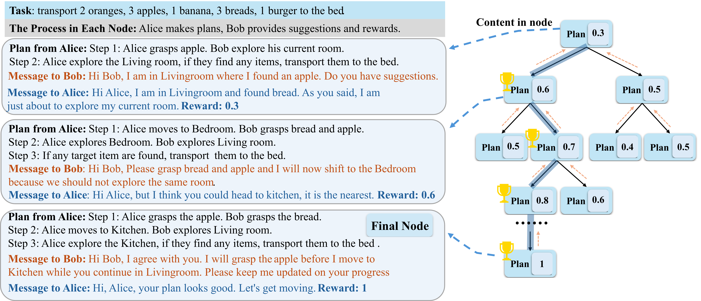

<div align="center">
  <h1> CVPR 2025 • Collaborative Tree Search for Enhancing Embodied Multi-Agent Collaboration </h1>
</div>


<p align="center">
<a href="https://openaccess.thecvf.com/content/CVPR2025/papers/Zu_Collaborative_Tree_Search_for_Enhancing_Embodied_Multi-Agent_Collaboration_CVPR_2025_paper.pdf" alt="arXiv">
    </a>
<a href="https://pytorch.org/"></a>
<a href="https://opensource.org/licenses/MIT"></a>
</p>

<p align="center">


</p>

---

This repository contains the official implementation of our CVPR 2025 paper:

**🤖Collaborative Tree Search for Enhancing Embodied Multi-Agent Collaboration🤖**  
_Lizheng Zu, Lin Lin, Song Fu, Na Zhao, Pan Zhou_  

> CoTS (Cooperative Tree Search) is a collaborative framework for embodied agents based on large language models, which enhances multi-agent planning and execution by guiding strategic discussions within a modified Monte Carlo Tree Search and evaluating plans to ensure coherent, efficient teamwork in complex tasks.

---
## 🧠 Framework of CoTS 

> **🧭 Plan → 🤔 Reflect & Score → 🌲 Search → ✅ Act**

CoTS builds upon the architecture of [CoELA](https://umass-embodied-agi.github.io/CoELA/), enables multiple LLM-based embodied agents to collaborate effectively by integrating large language models into a dynamic tree-based decision-making process. The four key stages are:

- 🧭 **Plan**: Agents collaboratively propose high-level strategies using LLM-generated dialogues.
- 🤔 **Reflect & Score**: Plans are reflected upon using custom LLM-based reward signals.
- 🌲 **Search**: A Monte Carlo Tree is built with branching proposals, allowing agents to evaluate multiple paths and correct one another.
- ✅ **Act**: Once a coherent plan is validated, agents execute actions in coordination. A plan evaluation module ensures consistency and adapts if plans become unsuitable.

<p align="center">
  
</p>

---

## 🌲 Cooperative Tree Search

CoTS enables agents to collaborate within a shared Monte Carlo Tree by generating, evaluating, and optimizing plans through language. This collaborative tree search is built upon the [LangGraph](https://github.com/langchain-ai/langgraph). 

<p align="center">
  
</p>

> **🧩 How it works:**  
> Each node in the tree contains content generated by **Alice** and **Bob**:  
> - 🤖 *Alice* proposes collaborative plans and sends messages to Bob.  
> - 🤖 *Bob* responds with messages to Alice and determines the plan rewards.  
> These rewards are used to backpropagate values, guiding the search process toward more promising and coherent joint plans.


---

## 📄 Paper & Resources

- **Paper (CVPR 2025)**: [View Paper](https://openaccess.thecvf.com/content/CVPR2025/papers/Zu_Collaborative_Tree_Search_for_Enhancing_Embodied_Multi-Agent_Collaboration_CVPR_2025_paper.pdf)
- **Poster**: [View Poster](https://cvpr.thecvf.com/media/PosterPDFs/CVPR%202025/32902.png?t=1747986549.597608)

---


## Installation

For detailed instructions on the installation of the two embodied multi-agent environments `Communicative Watch-And-Help` and `ThreeDWorld Multi-Agent Transport`, please refer to the Setup sections in [`tdw_mat/README.md`](tdw_mat/README.md) and [`cwah/README.md`](cwah/README.md) respectively. 

---

## 🚀 Running CoTS

We provide ready-to-use scripts for running CoTS in the following multi-agent embodied environments:

- 🏗️ **TDW-MAT** (`ThreeDWorld Multi-Agent Transport`) — [`tdw_mat/scripts`](tdw_mat/scripts)  
- 🤝 **CWAH** (`Communicative Watch-And-Help`) — [`cwah/scripts`](cwah/scripts) 

▶️ Example: Run CoTS in TDW-MAT using GPT-4

```bash
./scripts/test_LMs-gpt-4.sh
```
---

## 🔑 Notes on API Usage

This project uses the API in two parts. They occur in `tdw_mat/LLM/LLM.py` and `cwah/LLM/LLM.py`.

The first part is initialized as `client = OpenAI(model="", api_key="", base_url="")`. This part handles general natural language processing for the agents — such as interpreting observations, generating responses, or selecting actions — outside of the cooperative tree search process.

The second part is initialized as `mcts = MonteCarloTreeSearch(model="", api_key="", base_url="")`. This separation exists because collaborative planning often requires more advanced reasoning capabilities, and thus may benefit from stronger language models. It also allows for more flexibility in specifying different models for different components.

💡 **Important Note:** In our current paper and all reported experiments, we used the *same language model* (e.g., GPT-4) for both the general agent modules and the cooperative tree search. The separation of API calls is intended to support future exploration and modular improvements.

---

## 📚 Citation
If you find CoTS helpful in your research, please consider citing:

```bibtex
@inproceedings{zu2025collaborative,
  title={Collaborative Tree Search for Enhancing Embodied Multi-Agent Collaboration},
  author={Zu, Lizheng and Lin, Lin and Fu, Song and Zhao, Na and Zhou, Pan},
  booktitle={Proceedings of the Computer Vision and Pattern Recognition Conference},
  pages={29513--29522},
  year={2025}
}
```

---

## 🤝 Acknowledgements
Special thanks to the developers of CoELA and LangGraph! 🙏

---
