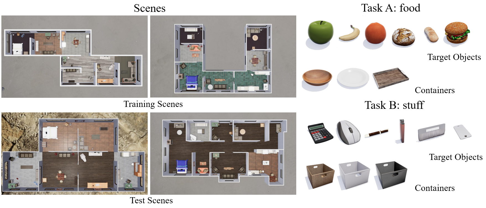

# TDW Multi-Agent Transport


## 📂 Codebase Layout

```
|__ tdw-gym/                    # Main environment and agent interfaces
|   |__ challenge.py            # Main evaluation script
|   |__ tdw_gym.py              # TDW-MAT wrapper
|   |__ h_agent.py              # RHP baseline agent
|   |__ lm_agent.py             # CoTS agent
|
|__ LLM/                        # CoTS LLM-based planning module
|   |__ planner/                # Tree search, scoring, and rewriting
|
|__ scene_generator/           # Dataset generation code
|
|__ dataset/                   # Predefined scenes and layout configs
|
|__ transport_challenge_multi_agent/    # Low-level TDW controllers
|
|__ scripts/                   # Scripts for training/evaluation
```

---

## 🔧 Setup

```bash
conda create -n tdw_mat python=3.9
conda activate tdw_mat
pip install -e .
```

If running TDW on a remote server, refer to the [TDW setup guide](https://github.com/threedworld-mit/tdw/blob/master/Documentation/lessons/setup/install.md).

To verify your setup:

```bash
python demo/demo_scene.py
```

---

## 🤖 Running Experiments

To run CoTS agents:

```bash
./scripts/test_LMs.sh
```

To run CoTS agents without ground truth masks:

```bash
./scripts/wo_gt_mask/test_LMs.sh --no_gt_mask
```

If TDW asset bundles fail to download automatically, download them manually [here](https://drive.google.com/file/d/1us2hpJj3_u1Ti_R0OrqVDgUQbdMPUaKN/view?usp=sharing) and unzip to the `TDW_MAT/` folder.

---

## 🧠 Vision Detection

For `no_gt_mask` setting, CoTS relies on Mask R-CNN trained using [MMDetection](https://github.com/open-mmlab/mmdetection). Installation:

```bash
pip install torch torchvision torchaudio
pip install -U openmim
mim install mmengine
mim install "mmcv>=2.0.0"
mim install mmdet
```

Download finetuned weights [here](https://drive.google.com/file/d/1S5id94R2rVeawVrES0eWQzCr_bW81Z3v/view?usp=drive_link) and place under `detection_pipeline/`.

To test detection:

```bash
python detection_pipeline/test_install.py
```

---

## 🧩 Environment Details

The multi-agent transport environment used in this project was originally introduced by [CoELA](https://umass-embodied-agi.github.io/CoELA/tdw_mat/), which extended the [ThreeDWorld Transport Challenge](https://arxiv.org/abs/2103.14025) into a collaborative setting. This environment features multiple embodied agents with ego-centric visual input, object manipulation capabilities, and natural language communication.

Our method, **CoTS**, builds directly upon this multi-agent framework, retaining its key environment design and task settings while improving agent coordination and planning via tree-structured reasoning and reflective scoring.

Agents are tasked with transporting target objects to a specified goal room using containers as tools. Each container can carry up to three objects, while agents can transport only two objects at a time without a container. Agents must reason about scene layout, object placement, and teammate behavior to complete the task efficiently.

---

### 🧪 Tasks

We evaluate in 6 scenes from the TDW-House dataset. Each scene includes 2 task types (`food`, `stuff`) and 2 container distribution settings (`Enough Container`, `Rare Container`), resulting in 24 episodes total.

- **Food Task**: Containers located in the kitchen and living room.
- **Stuff Task**: Containers located in the living room and office.

Settings:

- **Enough Container**: 1 container per 2 objects, in at most two rooms.
- **Rare Container**: 1 container per 5 objects, in a single room.

One example of scenes, target objects, and containers is shown in the following image:



---

### 📏 Metrics

- **Transport Rate (TR)**: Percentage of target objects successfully delivered.
- **Efficiency Improvement (EI)**: Cooperation gain over single-agent baselines.

---

### 🔁 Multi-Agent Asynchronized Execution

Agents act asynchronously — each action may take a different number of frames. One environment step ends when any agent completes an action. All agents then receive updated observations. If an agent is still acting but a new action is issued, it overrides the ongoing one immediately.

---

### 🏠 Gym Scenes

Scenes are built from modular floor plans with varied textures and furniture layouts. Each scene contains:

- 6–8 rooms  
- 10 target objects  
- 4 containers  
- Diverse layouts and material textures (e.g. tile, carpet, wood)

---

